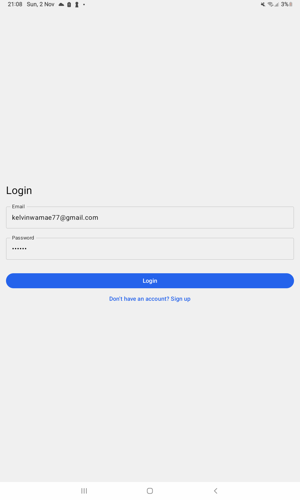
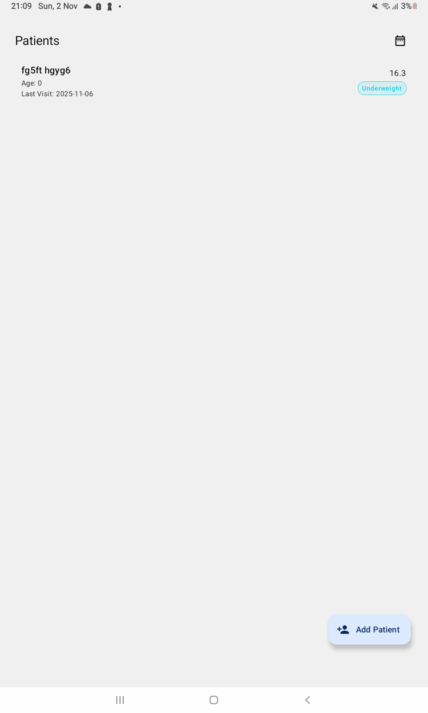
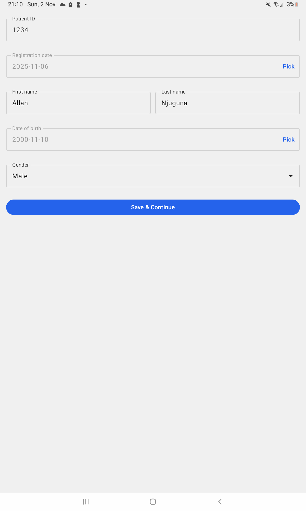
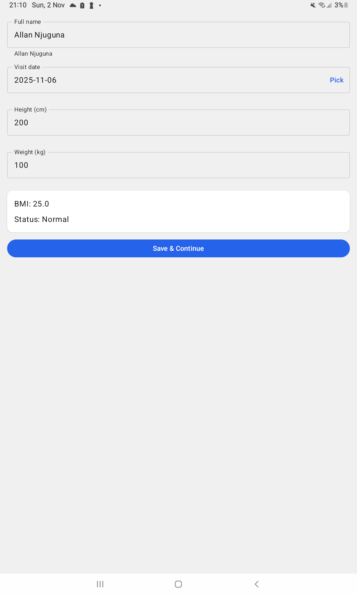
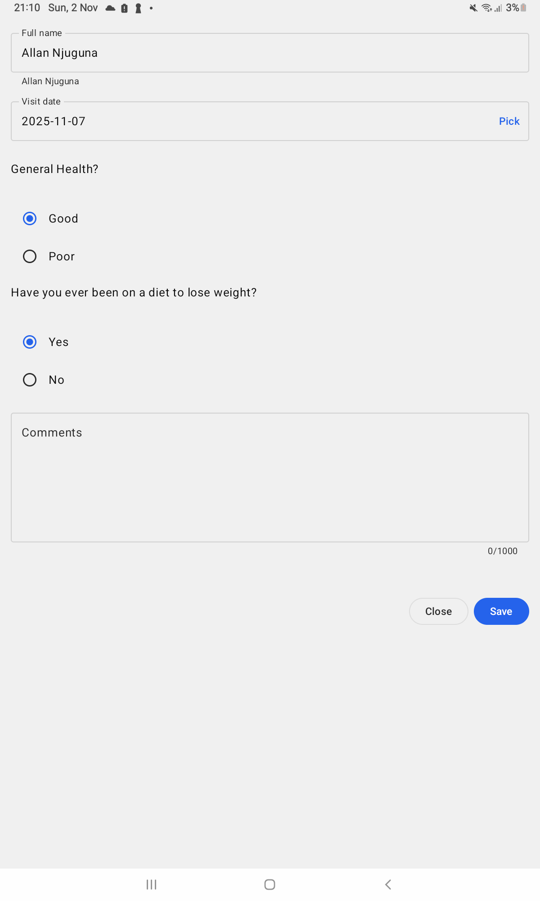
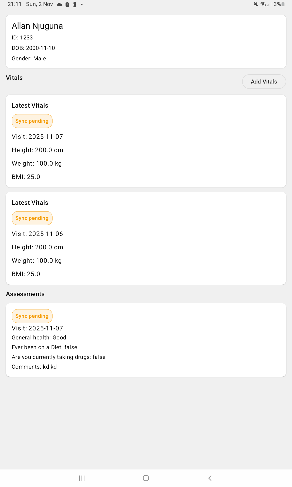

# PatientApp

A compact Android app (Jetpack Compose) for **Patient Registration → Vitals → BMI‑routed
Assessment (General/Overweight) → Listing with date filter**. Uses Kotlin, Hilt, Room, Paging 3,
WorkManager, Ktor, and DataStore.

---

## Quick Start

**Requirements**

- Android Studio **Ladybug** or newer
- JDK **11**
- Android SDK: **minSdk 26**, **target/compile 36**

**Run**

1. Clone and open in Android Studio.
2. Sync Gradle and build.
3. Run on device/emulator (Android 8.0+).

**API Config**

- Set your **Base URL** (and optional auth keys) in the remote/data layer (e.g.,
  `core/data/remote/`).
- Typical flow: **Sign Up → Log In → Register Patient → Add Vitals → Assessment → Listing**.

---

## What’s Implemented

- **Auth:** Sign up & login (token persisted via DataStore).
- **Patient Registration:** Unique ID; on save → navigates to **Vitals**.
- **Vitals:** Height/Weight input, auto‑calculated **BMI**.
- **Assessment:**
    - **General** shown when **BMI < 25**.
    - **Overweight** shown when **BMI ≥ 25**.
- **Patient Listing:** Name, Age, Last BMI status (Underweight/Normal/Overweight), with **date
  filter**.
- **Local Storage & Sync:** Room for offline data, WorkManager for background sync; Ktor for
  network.

---

## Project Structure

```
/*
-core
  -data
    -local        # Room (entities, DAOs), Paging
    -models       # DTOs / domain models
    -preference   # DataStore (tokens, settings)
    -remote       # Ktor client, API services
  -sync           # WorkManager jobs
  -utils          # Common helpers
-di               # Hilt modules
-feature
  -assessment     # General + Overweight UIs/logic
  -auth           # Signup/Login
  -common         # Shared UI/components
  -listing        # Patient list + filters
  -registration   # Patient registration
  -vitals         # Vitals entry + BMI calc
-navigation       # Nav graph & routes
-ui-theme         # Light/Dark themes, typography
-App              # App entry (Compose)
 */
```

---

## Tech Stack (Gradle Highlights)

- **Compose**: Material3, BOM, Icons Extended
- **DI**: Hilt (`com.google.dagger:hilt-android`, ksp compiler)
- **Persistence**: Room (runtime, ktx, paging, ksp compiler)
- **Paging**: Paging 3 (runtime + compose)
- **Networking**: Ktor (okhttp engine, content-negotiation, kotlinx.serialization, logging)
- **Background**: WorkManager + Hilt integration
- **State**: Kotlinx Serialization, DataStore Preferences
- **Kotlin/JVM**: `jvmTarget=11`

---

## Screenshots










